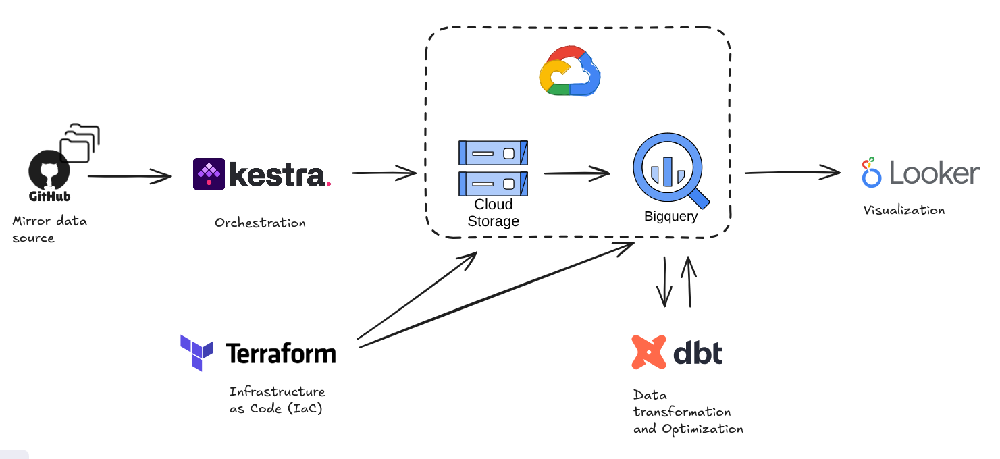
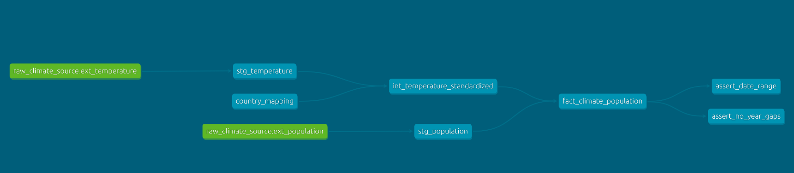
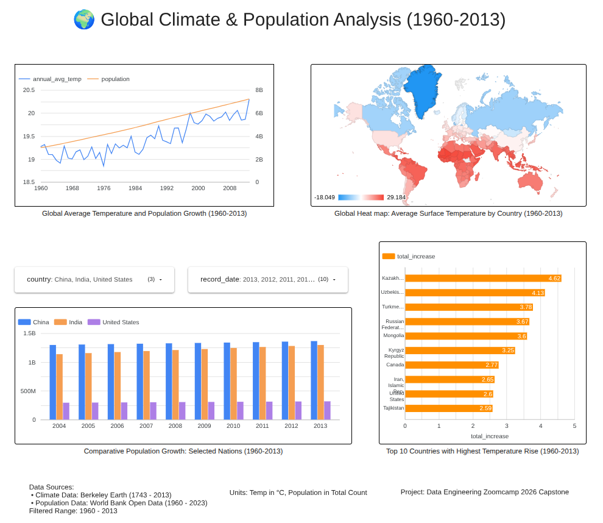

# 🌍 Global Climate & Population Analysis (1960-2013)

## 1. Problem Description

### **Overview**
Since the late 20th century, the global population has grown at an unprecedented rate. At the same time, rising temperatures and climate change have become some of the most urgent challenges facing the world today.
This project analyzes global population data and land temperature records from 1960 to 2013. By combining these two datasets, we aim to uncover the link between human population growth and climate shifts across different countries and regions.

### **The Challenges**
To perform a meaningful global analysis, several data engineering obstacles had to be overcome:

*  **Scattered Data:** Historical climate records (Berkeley Earth) and populatioh records (World Bank) reside in separate repositories. Relying on live third-party platforms for large-scale analysis is often unstable and prone to authentication or path changes.
*  **Format Mismatch:** The population data uses "Wide Format" (years as columns), which is hard to analyze, while temperature data is recorded monthly instead of annually.
*  **Naming Inconsistency:** Different sources use different names for the same country (e.g., "Russia" vs. "Russian Federation"). Without a fix, much of the data would be lost during merging.
*  **Slow Performance:** Processing over 50 years of data for over 200 countries is slow. Without optimization, creating dashboards would be expensive and laggy.  

### **The Solution**
This project implements an end-to-end Cloud Data Pipeline to transform raw, messy data into a clean "Single Source of Truth."

**Key technical solutions provided by this pipeline:**
*   **Orchestrated Ingestion:** Using Kestra to automate the retrieval of data from a reliable GitHub mirror and ingest it into a Google Cloud Storage (Data Lake).
*   **Advanced Transformation:** Using dbt to execute complex SQL logic:
    *   Unpivoting the population wide-table into a normalized long-table format.
    *   Aggregating monthly temperature records into annual averages.
*   **Standardized Mapping** Implementing a robust ISO-3166 mapping strategy using dbt seeds to ensure country names match perfectly across all datasets.
*   **Data Warehouse Optimization:** Organizing the final data in BigQuery using "Partitioning" and "Clustering." This ensures the Looker Studio dashboard loads in under a second and keeps cloud costs low.
  

## 2. Dataset Description

The analysis focuses on the **1960–2013** window, the period with the highest data density where both population and climate records overlap.

*   **Global Land Temp (Berkeley Earth):** Monthly average temperatures by country (1743–2013).
*   **World Population (World Bank):** Annual total population counts (1960–2023). This data was originally provided in **wide-format** (years as columns).

To ensure pipeline stability and reproducibility, all raw CSV files are mirrored in this repository. This approach bypasses third-party API authentication hurdles and prevents failures due to upstream path changes.

👉 **[View Full Metadata & Mirror Links](./data/raw/README.md)**  
  

## 3. Technologies Used

*   **Cloud Platform:** Google Cloud Platform (GCP)
*   **Infrastructure as Code:** Terraform
*   **Workflow Orchestration:** Kestra (Docker-based)
*   **Data Lake:** Google Cloud Storage (GCS)
*   **Data Warehouse:** BigQuery
*   **Data Transformation:** dbt (Core/CLI)
*   **Visualization:** Looker Studio
  

## 4. Project Architecture

### **4.1 Architecture Diagram**
 GitHub Mirror -> Kestra -> GCS (Data Lake) -> BigQuery External Tables -> dbt (Transformations/Tests) -> BigQuery Optimized Fact Table -> Looker Studio.
 

### 4.2 Pipeline Workflow
1.  **Infrastructure as Code (IaC):** **Terraform** is used to provision the Google Cloud Storage (GCS) bucket and BigQuery datasets, ensuring a reproducible and version-controlled cloud environment.
2.  **Orchestration:** **Kestra** (running on Docker) manages the end-to-end workflow:
    *   Downloads raw CSV files from the GitHub mirror.
    *   Uploads raw data to GCS (Data Lake).
    *   Creates external tables in BigQuery to make the raw data searchable.
3.  **Data Transformation (dbt):** The transformation logic follows a **Medallion Architecture**:
    *   **Staging:** Fixes data formats. Converting monthly temperatures to annual averages and reshaping population data into a usable layout (Unpivot).
    *   **Intermediate:** Standardizes country names using ISO codes and merges duplicates to ensure accuracy.
    *   **Marts:** Combines climate and population data into a single, high-performance table.
4.  **Optimization:** The final table in BigQuery is optimized with **Partitioning** and **Clustering** to enhance performance and reduce cost.
5.  **Visualization:** **Looker Studio** connects to the optimized BigQuery table, providing an interactive dashboard for exploring the links between population growth and climate change.
  

## 5. Data Warehouse Optimization

To ensure high performance and cost-efficiency for the analytical queries, the final tables are materialized as native BigQuery table with the following optimizations:

### **5.1 Partitioning by `record_date` (Yearly)**
*   **Applied to:** `fact_climate_population`
*   **How it works:** Since climate and population data are time-series based, users often filter by specific years (e.g., "1990–2010"). 
*   **Benefit:** BigQuery divides the table by year. When a user selects a date range, the system only "reads" the relevant years and skips the rest. This significantly speeds up queries and reduces cloud processing costs.

### **5.2 Clustering by `country`**
*   **Applied to:** `fact_climate_population` and `temp_increase_ranking`
*   **How it works:** A major part of this project involves comparing nations or searching for a specific country’s history (e.g., "China vs. USA").
*   **Benefit:** Clustering organizes and sorts the data by `country` within each yearly partition. This ensures that when a user filters the dashboard by a specific country, BigQuery can locate and retrieve those specific rows without scanning the entire dataset.
  

## 6. Transformations & Data Modeling (dbt)

This project uses **dbt** to transform raw data into clean, analysis-ready tables. The process follows a three-layer "Medallion" architecture.

### 6.1 Data Modeling Layers

#### **1. Staging Layer: Initial Cleanup**
This layer cleans the raw data and fixes formats to ensure consistency.
*   **`stg_temperature`**: Converts monthly temperature records into **annual averages**. This aligns the timeframe with the annual population data.
*   **`stg_population`**: Uses the `UNPIVOT` function to convert the "Wide Format" (years as columns) into a **Long Format** (years as rows). It also removes technical prefixes (like `year_`) added during the ingestion phase.

#### **2. Intermediate Layer: Standardization**
This layer ensures that data from different sources can be joined correctly.
*   **Standardization**: Uses a lookup table (seed) to map various country names (e.g., "United States" vs "USA") to standardized **ISO-3166 Alpha-3 codes**.
*   **Deduplication**: Merges duplicate records (e.g., combining "Denmark" and "Denmark (Europe)") by averaging their values. This ensures there is only one unique record per country per year.

#### **3. Marts Layer: Final Tables**
These are the optimized tables used directly by the dashboard.
*   **`fact_climate_population`**: The core table that joins climate and population data. It is materialized as a table and optimized with BigQuery **partitioning** (by year) and **clustering** (by country).
*   **`temp_increase_ranking`**: A summary table that calculates the total temperature rise for each country. It is materialized as a table and optimized with BigQuery **clustering** (by country).

### 6.2 Data Quality & Testing
To ensure the data is accurate, several automated tests run during the build process:
*   **Integrity Tests**: Generic tests verify that IDs are unique and no critical data is missing (`not_null`).
*   **Join Verification**: Ensures that joining tables did not create unexpected duplicate rows.
*   **Logic Tests**: Custom SQL tests verify that the data covers the correct timeframe (1960–2013) and that there are no missing years (continuity check).

### 6.3 dbt Lineage Graph

  

## 7. Visualization

  

## 8. How to Reproduce
For a detailed, step-by-step technical guide on how to reproduce this entire pipeline on Ubuntu 24.04, please refer to the documentation below:

👉 **[Detailed Reproduction Guide](./docs/reproduce.md)**

